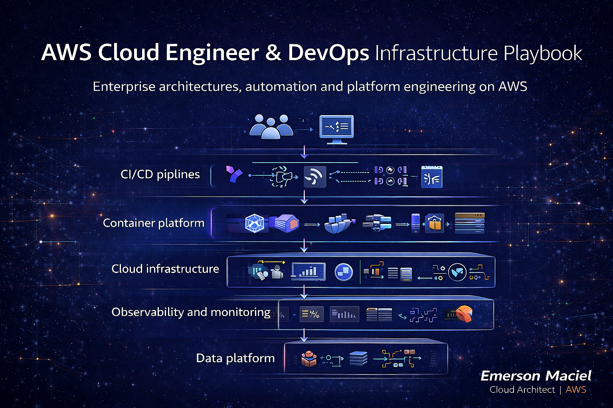

# AWS Cloud Engineer & DevOps Infrastructure Playbook

Advanced reference repository for **AWS Infrastructure Engineering, DevOps automation, CI/CD, Kubernetes, Terraform, Observability and Enterprise Cloud Platforms.**

Author  
**Emerson Maciel**  
Cloud Architect | AWS

---

## 📊 Repository Status

)

---

# Technology Stack

---

# What This Repository Teaches

This repository demonstrates **how real cloud engineering teams build and operate production AWS platforms.**

Topics covered:

- AWS Infrastructure Engineering
- DevOps Automation
- Infrastructure as Code
- CI/CD pipelines
- Kubernetes platforms
- Observability
- Data platforms
- Networking and CDN
- Cloud security
- Cost optimization

---

# Repository Structure

| Directory | Description |
|-----------|-------------|
| [docs/en](./docs/en) | English documentation |
| [docs/pt-BR](./docs/pt-BR) | Portuguese documentation |
| [setup](./setup) | Development environment setup |
| [iac](./iac) | Terraform and Terragrunt |
| [containers](./containers) | Docker, Kubernetes, Helm |
| [cicd](./cicd) | CI/CD pipelines |
| [observability](./observability) | Monitoring and logging |
| [data-platform](./data-platform) | Databricks infrastructure |
| [cdn](./cdn) | CloudFront and Akamai |
| [projects](./projects) | Complete architecture projects |

---

# Development Environment Setup

| Guide | Link |
|------|------|
| Windows setup | [setup/windows](./setup/windows) |
| Linux setup | [setup/linux](./setup/linux) |

Includes installation guides for:

- AWS CLI
- Terraform
- Terragrunt
- Docker
- Kubernetes
- Helm
- kubectl
- Git
- Python
- Node.js

---

# Infrastructure as Code

| Technology | Directory |
|-----------|----------|
| Terraform modules | [iac/terraform](./iac/terraform) |
| Terragrunt environments | [iac/terragrunt](./iac/terragrunt) |

Examples include:

- VPC architecture
- IAM policies
- Kubernetes clusters
- ECS services
- Networking

---

# CI/CD Pipelines

| Tool | Directory |
|-----|-----------|
| GitHub Actions | [cicd/github-actions](./cicd/github-actions) |
| GitLab CI | [cicd/gitlab-ci](./cicd/gitlab-ci) |
| Jenkins | [cicd/jenkins](./cicd/jenkins) |

---

# Containers & Orchestration

| Technology | Directory |
|-----------|-----------|
| Docker | [containers/docker](./containers/docker) |
| Kubernetes | [containers/kubernetes](./containers/kubernetes) |
| Helm Charts | [containers/helm](./containers/helm) |

---

# Observability

| Platform | Directory |
|---------|-----------|
| AWS CloudWatch | [observability/cloudwatch](./observability/cloudwatch) |
| Grafana | [observability/grafana](./observability/grafana) |
| DataDog | [observability/datadog](./observability/datadog) |

---

# Data Platforms

| Technology | Directory |
|-----------|-----------|
| Databricks | [data-platform/databricks](./data-platform/databricks) |

---

# CDN Architectures

| CDN | Directory |
|----|-----------|
| CloudFront | [cdn/cloudfront](./cdn/cloudfront) |
| Akamai | [cdn/akamai](./cdn/akamai) |

---

# Example Projects

| Project | Description |
|-------|-------------|
| [enterprise-platform](./projects/enterprise-platform) | enterprise AWS landing zone |
| [microservices-platform](./projects/microservices-platform) | Kubernetes microservices |
| [data-platform](./projects/data-platform) | Databricks analytics platform |

---

# Architecture Diagrams

| Diagram | Link |
|-------|------|
| DevOps Platform Architecture | [diagrams/devops-platform.md](./diagrams/devops-platform.md) |
| Kubernetes Platform | [diagrams/kubernetes-platform.md](./diagrams/kubernetes-platform.md) |
| Observability Stack | [diagrams/observability-stack.md](./diagrams/observability-stack.md) |

---

# Author

**Emerson Maciel**  
Cloud Architect | AWS

---

# License

MIT License
